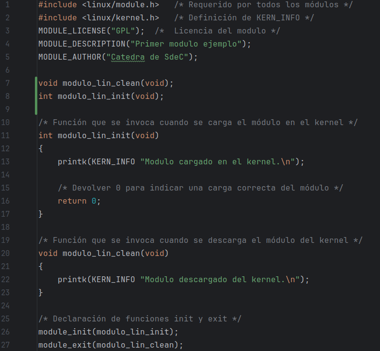
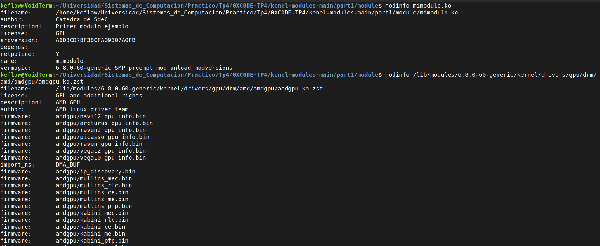
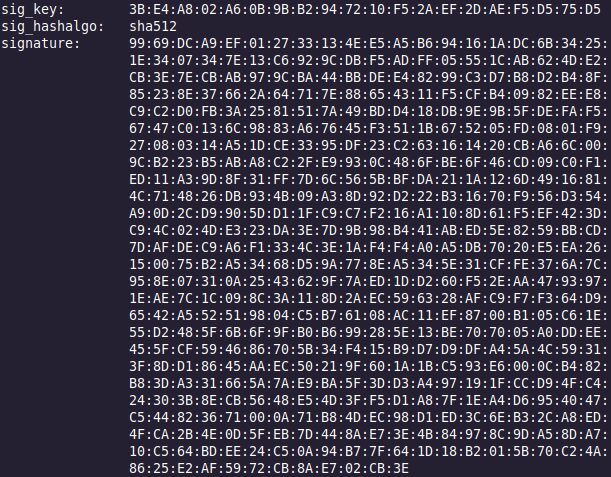
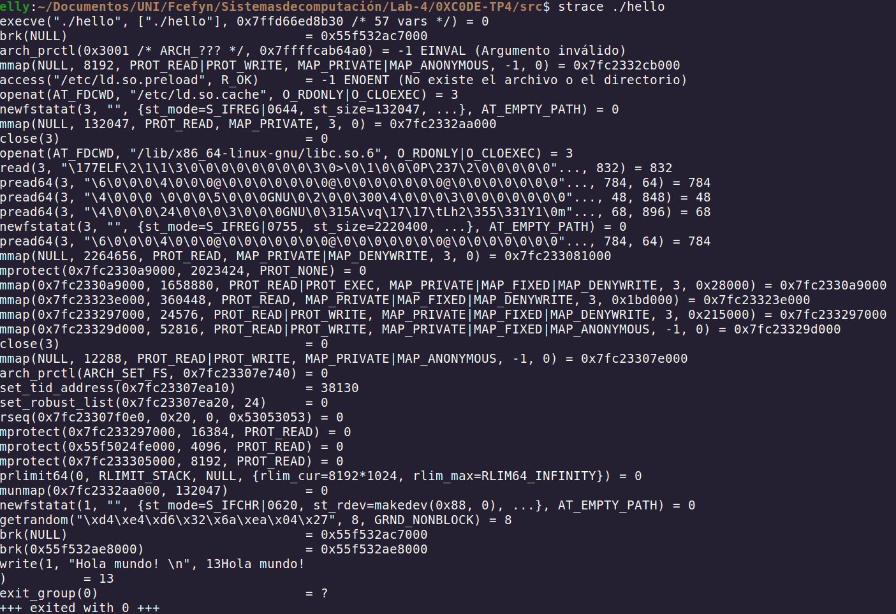

# 0XC0DE - Sistemas de Computación Tp4

## Modulos de Kernel
Un Módulo de Kernel Linux se define como un segmento de código capaz de cargarse y descargarse dinámicamente dentro del kernel según sea necesario.
Estos módulos mejoran las capacidades del núcleo sin necesidad de reiniciar el sistema. 
Un ejemplo notable es el módulo de controlador de dispositivo, que facilita la interacción del núcleo con los componentes de Hardware vinculados al sistema. 

En ausencia de módulos, el enfoque predominante se inclina hacia los núcleos monolíticos, que requieren la integración directa de nuevas funcionalidades en la imagen del núcleo.

Este enfoque da lugar a núcleos más grandes y requiere la reconstrucción del núcleo y el subsiguiente reinicio del sistema cuando se desean nuevas funcionalidades.

Para comenzar vamos a necesitar instalar algunas dependencias:
```
sudo apt-get install build-essential checkinstall kernel-package linux-source
```

### **¿Qué es checkinstall y para qué sirve?**

Generalmente en entorno Linux, cuando se compila software desde un código fuente, el proceso es casi siempre el mismo. 

Primero se crea un archivo **Makefile** que contiene las instrucciones para el proceso de compilación, especificando como compilar y enlazar los archivos fuente:
```
make 
sudo make install
```

El último comando es opcional y lo que hace es que **make install** copia directamente los archivos binarios y de configuración al sistema de archivos, en donde las rutas mas típicas son: */usr/local/bin* , */usr/local/lib*. 

Este método es funcional pero no gestiona de la mejor manera la ubicación ya que no existe ningún registro de que archivos fueron instalados y en donde, al momento de desinstalar el software pueden quedar algunos archivos residuales, rompe la trazabilidad del sistema ya que el gestor de paquetes que tenemos no sabe nada del software instalado.

**Checkinstall** es una herramienta que resuelve todos estos problemas actuando como el reemplazo del comando **make install**.

Entonces, en lugar de instalar los archivos directamente en el sistema, Checkinstall monitorea los archivos que se copiarán durante la instalación y crea un paquete instalable para el sistema de gestión de paquetes que estemos usando (apt o dnf), esto incluye los formatos del tipo **.deb** (Debian, Ubuntu y derivados), **.rpm** (Fedora, Red Hat) y **.tgz** (Slackware).

Después de hacer esto instala el paquete creado de manera controlada, registrándolo en la base de datos del sistema de paquetes.

Algunas ventajas de usar esta herramienta:
   
- Se sabe exactamente que archivos se instalaron y donde
- Es fácil de eliminar el software, se puede utilizar **apt remove** o el comando equivalente.
- Previene posibles futuros conflictos ya que detecta si otro software intenta sobrescribir los mismos archivos.
- Es auditable ya que mantiene su trazabilidad.

### Crear un Hello_world y empaquetarlo

Primero escribimos el siguiente programa en C que contiene un hola mundo:
``` code
#include <stdio.h>
int main(){
    printf("Hola mundo! \n");
    return 0;
}
```

Para cumplir las normas de la utilización de la herramienta de Checkinstall necesitamos crear un **Makefile** y un **description-pak**.

Una vez creados, ejecutamos los siguientes comandos en la consola:

``` bash
make
sudo checkinstall
```

La consola mostrará la siguiente salida:


en donde podemos cambiarle el nombre a nuestro paquete a **hello-world**

Luego de esto, la consola muestra la siguiente salida:


Después de esto ya tenemos nuestro código de Hola mundo! creado y empaquetado, se ve de la siguiente manera:


Y podemos corroborar ingresando lo siguiente en consola:


Para desinstalar este paquete, podemos utilizar lo siguiente:

``` bash
sudo dpkg -r hello-world
```
### Seguridad del Kernel
**Rootkits:** es un software malicioso que da acceso privilegiado al sistema mientras se oculta, modificando el kernel u otros componentes.

Dado que la seguridad del kernel de linux es importante para proteger sistemas contra amenazas como los módulos no firmados y rootkits, nombramos a continuación algunas de las medidas que podemos implementar para mejorar la seguridad del Kernel.

- **Firmar módulos del Kernel:** El kernel de linux permite extender sus funcionalidades mediante módulos, que son piezas de código cargadas dinamicamente.
    El hecho de tener módulos no firmados pueden representar riesgos ya que podrían contener algún tipo de malware.
    
    En sistemas con **Secure Boot**, los módulos deben estar firmados con una clave privada y verificados con la clave pública


- **Habilitar Secure Boot:**
    Esto se encuentra disponible en firmware UEFI y requiere que todos los cargadores de arranque y módulos de kernel estén firmados con claves de confianza

- **Configurar module.sig_enforce:** esto se utiliza para rechazar los módulos sin firma.+

### ¿Qué funciones tiene disponible un programa y un módulo?
Primero definimos algunos conceptos:

**Programa:** en un espacio de usuario, es una aplicación que corre en el entorno del usuario. Estas aplicaciones interactúan con el sistema operativo a través de interfaces definidas, usando bibliotecas estándares y llamadas al sistema.

**Módulo de kernel:** es un componente que se carga dinámicamente en el kernel de Linux para extender su funcionalidad. Estos operan en el espacio de kernel, donde las reglas son más estrictas para garantizar la estabilidad y seguridad del sistema.

Los programas, al tener una librería estándar de C, tienen un amplia gama de funciones proporcionadas por la biblioteca estándar de C, algunas funciones son: *printf(), malloc(), fread(), fwrite().*
Ademas de esto, los programas pueden realizar llamadas al sistema (System calls). Algunos comandos son: *open(), read(), write()*

Los módulos de kernel no tienen acceso a las bibliotecas estándar de C, por lo que los módulos unicamente tienen acceso a funciones especificas proporcionadas por el kernel como por ejemplo, gestión de dispositivos, interrupciones, comunicación directa con el hardware. El archivo /proc/kallsyms contiene todos los símbolos que el kernel conoce, por lo que son accesible para sus módulos ya que comparten el espacio de código del kernel.

### Espacio de Usuario - Espacio de Kernel
El **espacio de usuario** es el entorno en donde se ejecutan las aplicaciones de usuario (navegadores, editores de texto, etc). Estas aplicaciones están aisladas del hardware y de la memoria del kernel para garantizar seguridad y estabilidad.

El **espacio de kernel** es un área privilegiada donde opera el kernel de Linux y sus módulos. En este espacio, el código tiene acceso directo al hardware y a los recursos del sistema, lo que lo hace muy poderoso pero exige precaución para evitar fallos.

### Name Space
El Name Space hace referencia a todo el conjunto de nombres (variables, símbolos) que deben ser únicos dentro del kernel para evitar conflictos. En la programación de módulos de kernel, este concepto es crucial porque los módulos se vinculan con todo el kernel, compartiendo su entorno, por lo que se podrían originar problemas.

Los símbolos reconocidos por el kernel se encuentran en el archivo /proc/kallsyms.

### Code Space
Se refiere al área de memoria donde se ejecuta el código del kernel y sus módulos. Este concepto esta relacionado a la gestión de memoria en linux.

A diferencia de los procesos de usuario, que tienen espacios de memoria separados, este espacio de código es compartido por todos los módulos de kernel por lo que un error en un módulo puede afectar a todo el kernel y NO solo al módulo.

### Drivers
Un driver es un componente del sistema operativo, específicamente un módulo del kernel que permite la comunicación entre el sistema operativo y los dispositivos de hardware. 

Su propósito principal es actuar como un intermediario, ofreciendo una interfaz estandarizada para que los programas de usuario puedan interactuar con el hardware sin necesidad de conocer sus detalles técnicos específicos.

**/dev** es un directorio especial en sistemas Unix-Like que contiene **archivos de dispositivos**. Estos archivos representan tanto dispositivos de hardware físico (discos duros, puertos seriales) como dispositivos virtuales, y sirven como puntos de acceso para que los programas interactúen con ellos mediante operaciones estándar de archivos como leer o escribir.

Cada archivo en /dev está asociado a un **número mayor** y un **número menor**.

El **número mayor** identifica el driver encargado de manejar el dispositivo, por ejemplo: */dev/sda1 , /dev/sda2* son controlados por el mismo driver de disco.

El **número menor** distingue entre diferentes instancias o particiones del mismo tipo de hardware manejado por ese driver.

Además, los dispositivos se dividen en dos categorías:

- Dispositivos de bloque: son identificados con una 'b' cuando ponemos el comando **ls -l** por ejemplo el */dev/sda1*. Esto significa que manejan datos en bloques y usan buffers para optimizar operaciones.

- Dispositivos de caracteres: son identificados con una 'c', por ejemplo: /dev/ttyS0. Estos dispositivos manejan flujos de datos sin un tamaño fijo, un uso general es en puertos seriales.

## Segunda parte


Es importante que toda nuestra ruta no contenga ningún caracter especial ni espacios, ya que esto genera un error al ejecutar el comando "make".

### Insertar y visualizar mimodulo.ko
Luego de esto, debemos ejecutar los siguientes comandos:
``` 
cd kenel-modules-main/part1/module
make
```

Notamos que al ejecutar al make se genera la siguiente advertencia:


Por lo que para solucionarla simplemente agregamos los **prototipos** de las funciones en nuestro programa [mimodulo.c](kenel-modules-main/part1/module/mimodulo.c), por lo que queda de la siguiente manera:


Ahora ejecutamos lo siguiente: 
``` 
sudo insmod mimodulo.ko
```
Este comando, inserta el módulo "mimodulo.ko" en el kernel.

Y después mostramos los mensajes del "kernel ring buffer" utilizando lo siguiente:
``` 
sudo dmesg
```

Lo que nos muestra una extensa lista de todos los módulos cargados en el kernel.

Para poder filtrar la lista y mostrar unicamente aquellos que contengan en su nombre "mimodulo", utilizamos el comando **lsmod | grep mimodulo** para verificar que se cargó exitosamente.

Otra manera de ver si nuestro módulo se cargó exitosamente es utilizar **cat /proc/modules | grep mimodulo** y visualizamos la siguiente salida por consola:


### Comparación entre nuestro módulo cargado y otro genérico

Para realizar este paso primero tenemos que elegir un módulo genérico, en nuestro caso elegimos el **amdgpu.ko.zst** que se encuentra en */lib/modules/6.8.0-60-generic/kernel/drivers/gpu/drm/amd/amdgpu*.

Para compararlos utilizamos el siguiente comando y contrastamos las diferencias:
``` 
modinfo mimodulo.ko
modinfo amdgpu.ko.zst
```


El segundo módulo está cortado ya que contiene demasiada información adicional extra.

### Consignas
1) ¿Qué diferencias se pueden observar entre los dos modinfo?

    Este comando refleja el contraste entre un módulo de ejemplo simple que fue desarrollado localmente y un driver de dispositivo complejo y altamente integrado que forma parte del kernel oficial de Linux.
    
    La diferencia más relevante que se observa es el campo *signature* que contiene la firma del módulo permitiendo su uso en modo **Secure Boot**
    


2) ¿Qué divers/modulos están cargados en sus propias pc? 

    Para poder hacer esto, estando en el directorio de "0XC0DE-TP4", vamos a ejecutar el siguiente comando con el que vamos a cargar toda la lista de los modulos/drivers en nuestra carpeta outputs:
    ``` 
    lsmod > outputs/modulos_cargados0.txt
    ```
   Y para ver las diferencias utilizamos la pagina [diff checker](https://www.diffchecker.com/) cuya salida es la siguiente:

   

   Se observa a demás de los diferentes módulos que el propio modulo mimodulo tiene tamaños distintos en ambos sistemas, esto se puede deber a diferencias en el proceso de compilación.

3) ¿Cuáles no están cargados pero están disponibles? que pasa cuando el driver de un dispositivo no está disponible.

	Ejecutando el comando:
	
```
find /lib/modules/$(uname -r)/kernel/ -type f -name "*.ko"
```

   Podemos ver una lista de todos los módulos disponibles independientemente de si están o no cargados. Podemos ejecutar un *grep* para verificar que los módulos retornados en el punto anterior existen en esta lista.

   Si un módulo aparece en esta lista pero no es retornado por *lsmod* significa que el módulo está disponible pero no cargado. 
   
   Si un módulo no está disponible en el sistema los dispositivos asociados no funcionarán correctamente o no serán accesibles.

4) Correr hwinfo en una pc real con hw real y agregar la url de la información de hw en el reporte.
    
   En nuestro caso utilizamos la herramienta de https://linux-hardware.org/ y ejecutamos lo siguiente:

    ``` 
    sudo -E hw-probe -all -upload
    ```
    Lo que crea una prueba de información sobre nuestro hardware actual.

    Las URL generadas de nuestras pruebas son las siguientes:
    - https://linux-hardware.org/?probe=9356aa062b
    - https://linux-hardware.org/?probe=ce24a88f4f

5) ¿Qué diferencia existe entre un módulo y un programa?

   Tomando las definiciones dadas [previamente](#qué-funciones-tiene-disponible-un-programa-y-un-módulo) podemos identificar como diferencias que:
   
   - Los programas se ejecutan en entornos de usuario mientras que los módulos operan en espacio de kernel.
   - Los módulos no tienen acceso a bibliotecas estándar, sino que solo pueden acceder a las funciones que el kernel les proporciona.
   - Los programas están aislados del kernel mientras que los módulos tienen los privilegios del mismo.
   - Los programas acceden a los recursos mediante llamadas de sistema, los módulos tienen control directo sobre el hardware.
 
6) ¿Cómo puede ver una lista de las llamadas al sistema que realiza un simple helloworld en c?

Para ver las llamadas al sistema realizadas por cualquier programa utilizamos la herramienta *strace* pasando como argumento el programa a ejecutar. Un ejemplo de salida con el programa *hello* que se encuentra en el directorio src/ se muestra a continuación:



7) .¿Qué es un segmentation fault?
   
Un segmentation fault (o “fallo de segmentación”) ocurre cuando un programa intenta acceder a una zona de memoria que no tiene derecho a utilizar. El sistema operativo protege ciertas áreas de memoria, y si un proceso se sale de su espacio permitido, ocurre este tipo de error.

En términos simples: es como si un programa intentara entrar a una habitación cerrada sin permiso. El sistema operativo, actuando como "guardia", lo detecta y termina al programa por seguridad.

 ¿Cómo maneja esto el kernel de Linux?

- Cada proceso corre en su **espacio de usuario** (user space), separado del resto.

- Cuando un programa comete un acceso inválido a memoria, el **MMU (Memory Management Unit)** del CPU detecta que se intentó leer o escribir en una dirección no permitida.

- El hardware genera una **excepción de tipo "page fault"**.

- El kernel intercepta esa excepción y determina que es un acceso inválido.

- El kernel envía al proceso una **señal SIGSEGV** (Signal Segmentation Violation).

- Si el programa **no atrapa la señal**, el proceso es **terminado inmediatamente**.

- Opcionalmente, se puede generar un **core dump**, un volcado del contenido de la memoria, para ser analizado con GDB u otras herramientas.

¿Cómo maneja esto un programa?

Cuando un programa accede a memoria inválida (por ejemplo, accede a un puntero nulo o fuera de los límites del arreglo), el sistema operativo envía una señal al proceso: SIGSEGV (Signal: Segmentation Violation).

Por defecto, esta señal hace que:

- El programa termine inmediatamente.

- El sistema puede (opcionalmente) generar un archivo de volcado de memoria (core dump) para diagnóstico.

8) ¿Se animan a intentar firmar un módulo de kernel ? y documentar el proceso ?

Lo primero que debemos hacer para firmar un módulo es verificar las configuraciones del kernel para firmar módulos. Para ello debemos acceder a */usr/src/kernel-headers-$(uname -r)* (El directorio exacto puede variar entre sistemas). Una vez dentro de este directorio debemos leer el archivo *.config* y verificar los valores **CONFIG_MODULE_SIG**.


Las opciones que aparecen son:

- CONFIG_MODULE_SIG: Habilita las utilidades de firma de módulos.
- CONFIG_MODULE_SIG_FORCE: Si está habilitado solo se podrán cargar módulos firmados.
- CONFIG_MODULE_SIG_ALL: Si está habilitado los módulos se firmarán automáticamente durante la instalación, sino deberán ser firmados manualmente con un script que se verá más adelante.
- CONFIG_MODULE_SIG_SHA512: Indica que el algoritmo de hasheo que se utilizará sera el SHA512. Las lineas anteriores son para otros algoritmos que en este caso están desactivados.
- CONFIG_MODULE_SIG_HASH: Idem al anterior. Indica que algoritmo se utilizará.
- CONFIG_MODULE_SIG_KEY: Dirección del archivo .pem que contiene la clave privada y las credenciales. El valor por defecto es certs/signing_key.pem, si el valor se cambia por cualquier otro no se podrá utilizar la firma automática de módulos.

Lo más importante para lo que buscamos hacer es CONFIG_MODULE_SIG_HASH ya que nos indica el algoritmo que debemos utilizar para firmar el módulo.

Ahora sí para firmar el módulo debemos primero generar un par de claves público/privada lo que podemos hacer con openssl:

```
openssl req -new -x509 -newkey rsa:2048 -keyout signing_key.pem -out signing_key.pem   -nodes -days 36500 -subj "/CN=My Module Signing Key/"
```

Esto generará un archivo *signign_key.pom* en el directorio actual. A continuación podemos utilizar este par de claves para firmar el módulo utilizando un script del kernel que se encuentra en el directorio *usr/src/kernel-headers-$(uname -r)/scripts/sign-file*:

```
/usr/src/linux-headers-$(uname -r)/scripts/sign-file sha512 signing_key.pem signing_key.pem mimodulo.ko
```

Notese que el argumento *sha512* se corresponde al valor que se encontraba en CONFIG_MODULE_SIG_HASH. Podemos verificar que el módul ofue firmado ejecutando:

```
modinfo mimodulo.ko
```

La salida deberá ser similar a esta:


Si los parámetros *sig* no están presentes entonces el módulo no fue firmado. Ahora si cargamos el módulo y ejecutamos *cat /proc/modules | grep mimodulo* seguiremos viendo una salida como esta:


El símbolo **(OE)** indica 2 cosas:

- O: El módulo proviene de un lugar externo al árbol (Out-Of-Tree)
- E: No se puede verificar la firma del módulo (Errors in signature verification)

Esto se debe a que aunque el módulo este firmado el mismo no pertenece al *keyring* de claves confiables del kernel.

Para agregar la firma al *keyring* del kernel primero debemos separar nuestro archivo .pem ya que el mismo contiene tanto clave pública como privada y el *keyring* del kernel solo admite las claves públicas o archivos .der. Para obtener este archivo obtenendremos las credenciales del archivo .pem y luego las convertiremos en un archivo .der como se muestra a continuación.

```
openssl x509 -in signing_key.pem -outform PEM -out signing_key.crt
openssl x509 -in signing_key.crt -outform DER -out signing_key.der
```

Ya generado este archivo utilizaremos el comando *mokutil* para cargar la clave al *keyring*:

```
sudo mokutil --import signing_key.der
```

Cuando ejecutemos este comando se nos pedirá que insertemos una contraseña, es importante que la recordemos. Una vez hecho esto debemos reiniciar el sistema, al hacerlo se nos presentará un menú en una pantalla azul, en este debemos seleccionar la opción **Enroll MOK** donde MOK significa *Machine Owner Key*. Una vez seleccionado esto debemos buscar la clave que generamos (En teoría debería ser la única) y se nos pedirá ingresar la contraseña que generamos previamente. 

Finalizado este proceso continuamos con el reboot y ahora sí, al cargar nuestro módulo con *inmod* veremos que el mismo ya no aparece con el símbolo **E**, indicando que el módulo tiene una clave válida.


9) .
10) .¿Que pasa si mi compañero con secure boot habilitado intenta cargar un módulo firmado por mi? 

Si mi compañero tiene Secure Boot activado, su sistema solo permite cargar módulos del kernel que estén firmados digitalmente con una clave reconocida como segura. Esto forma parte de una medida de seguridad que evita la ejecución de código malicioso a bajo nivel (como rootkits).

Si yo firme mi módulo con una clave propia (que no está registrada en su sistema), el kernel va a rechazar la carga del módulo, incluso si está correctamente firmado. Mostrará un error indicando que la firma no es válida o que falta la clave.

Para que pueda cargarlo, tendría que importar mi clave pública al sistema usando herramientas como mokutil, y luego autorizarla manualmente al reiniciar, para que Secure Boot la reconozca como confiable.

Con Secure Boot activo, no alcanza con firmar el módulo, también es necesario que la clave usada esté autorizada por el sistema.


11) Basado en la siguiente nota https://arstechnica.com/security/2024/08/a-patch-microsoft-spent-2-years-preparing-is-making-a-mess-for-some-linux-users/ :

- **¿Cuál fue la consecuencia principal del parche de Microsoft sobre GRUB en sistemas con arranque dual (Linux y Windows)?**

    Los sistemas ya no podían iniciar Linux debido a una violación de política de seguridad del Secure Boot.

    
- **¿Qué implicancia tiene desactivar Secure Boot como solución al problema descrito en el artículo?**

    Desactivar Secure Boot implica comprometer la seguridad del sistema, ya que Secure Boot impide la carga de código no firmado durante el arranque. Al desactivarlo para permitir la carga de controladores o módulos que el parche de Microsoft bloquea, se abre la posibilidad de que malware o rootkits se carguen sin restricciones al iniciar el sistema.

- **¿Cuál es el propósito principal del Secure Boot en el proceso de arranque de un sistema?**

    Verificar que solo se ejecuten binarios firmados y autorizados durante el arranque.
### Borrar el modulo cargado
Una vez que comprobamos que el módulo se cargó, lo vamos a remover y vamos a comprobar que ya no existe utilizando lo siguiente:
``` 
sudo rmmod mimodulo
sudo dmesg
lsmod | grep mimodulo
```

Notamos que ahora la consola no devuelve nada y esto se debe a que el módulo cargado anteriormente ya no existe en el kernel.


